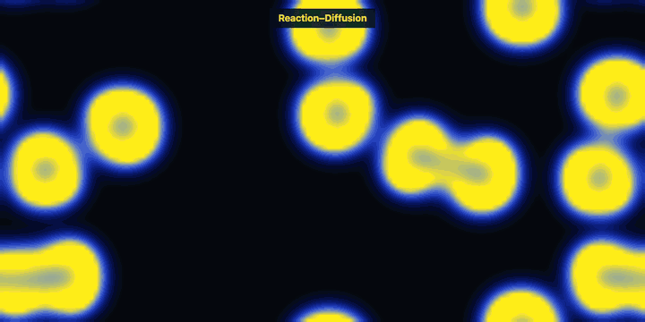
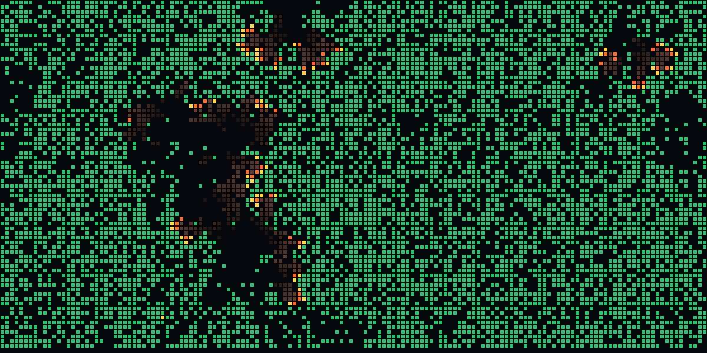
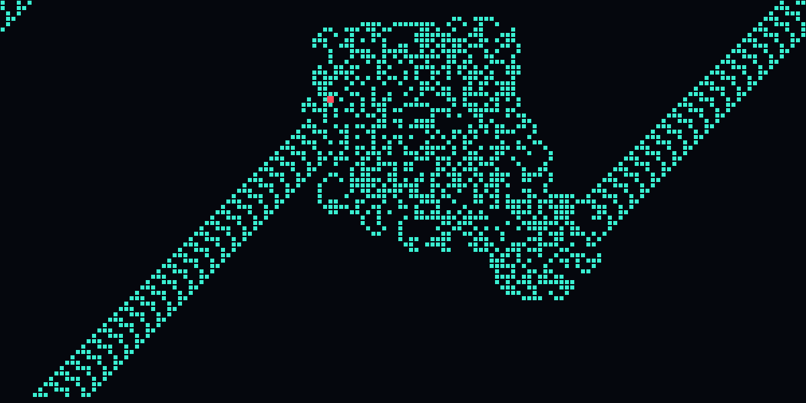
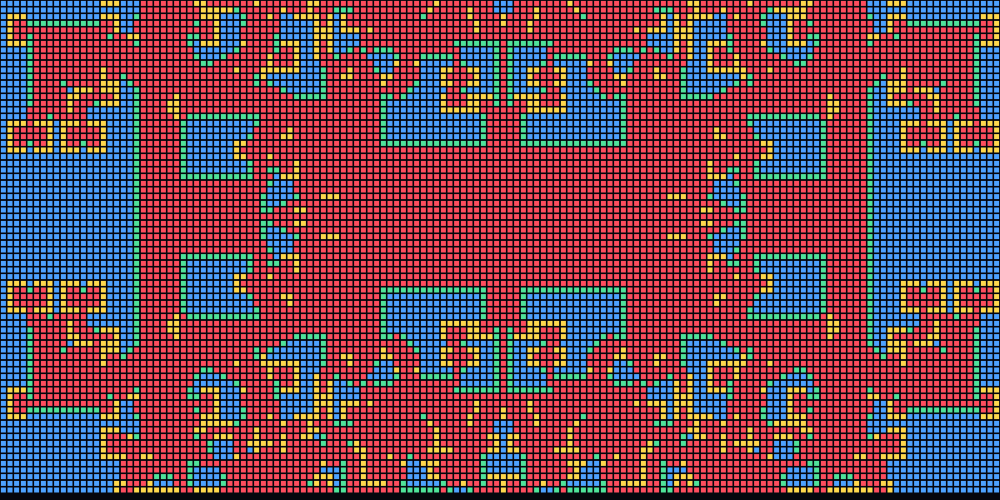
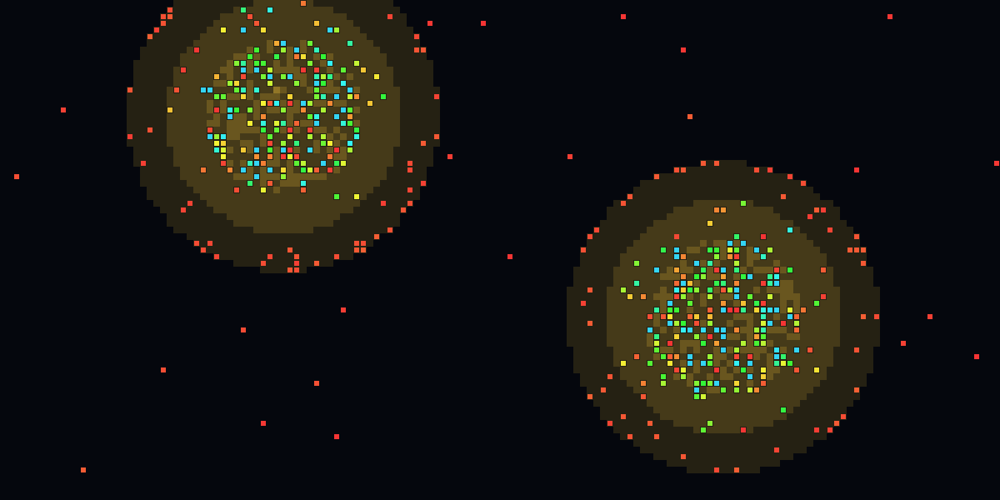
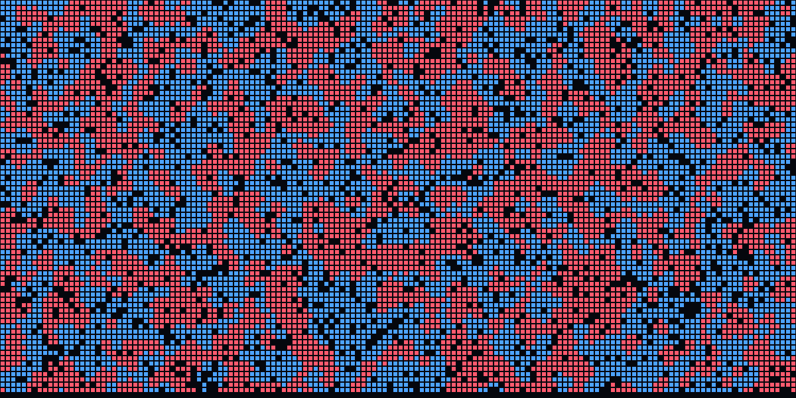
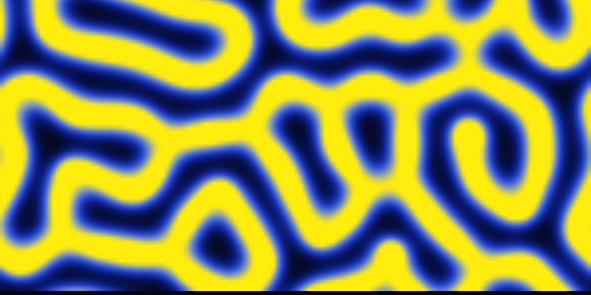

# 🧫 細胞實驗室 Cell Lab

八個「每個個體只看鄰居」的互動模擬。規則都只有幾行，卻會自己長出隔離、疫情、貧富差距、斑馬紋，以及混沌中的秩序。

單一 HTML 檔、零相依、不需要建置，開啟 `index.html` 就能玩，也可以當螢幕保護程式放著看。

**▶ [線上玩：shanchiehchiu.github.io/cell-lab](https://shanchiehchiu.github.io/cell-lab/)**



## 八個模型

| 模型 | 一句話 | 你可以調 |
|---|---|---|
| **生命遊戲** | 兩條生死規則，長出滑翔機、閃燈、滑翔機槍；內建圖案辨識雷達和碰撞實驗 | 密度、速度、泡泡對話 |
| **謝林隔離** | 沒有人想隔離，只要「至少 35% 鄰居跟我同色」，最後卻自己分區 | 容忍度、空地比例 |
| **傳染病 (SIR)** | 居民走動、接觸、感染、康復，附即時感染曲線 | 感染率、康復時間、活動力（封城）、疫苗率 |
| **囚犯困境（空間版）** | 合作者與背叛者互相模仿最高分的鄰居，中央一個背叛者炸出萬花筒 | 誘惑值 b、初始合作比例 |
| **糖景** | 兩座糖山、天生視野與代謝不同的居民，貧富差距（基尼係數）自己長出來 | 人數、糖再生速度、視野 |
| **反應擴散** | Gray-Scott 模型，長出珊瑚、迷宮、細胞分裂般的斑紋 | 餵食 f、殺死 k |
| **森林大火** | 樹木生長、閃電點火、火沿樹林蔓延，火災大小呈冪律分布 | 生長、蔓延、閃電頻率 |
| **蘭頓螞蟻** | 兩條規則的螞蟻，先混沌亂走上萬步，再突然蓋出斜向「高速公路」 | 規則（RL、RLR…）、螞蟻數 |

| | |
|---|---|
|  |  |
|  |  |
|  |  |

## 怎麼玩

**第一次打開**會有開場說明：按「自動播放」就是螢幕保護程式模式（每 30 秒自動換模型與參數，點一下或移動滑鼠即停止）；按「自己玩」則用右上角的控制面板切換模型、調滑桿。

| 桌機快捷鍵 | 功能 |
|---|---|
| 空白鍵 | 暫停／繼續 |
| `R` | 重新開始目前模型 |
| `↑` `↓` | 調速度 |
| `U` | 隱藏／顯示介面（`Esc` 叫回） |
| `A` | 開關自動輪播 |
| 左鍵／右鍵 | 依模型不同：畫細胞、放火、撒糖、滴入種子…（右鍵通常是相反動作） |

手機：面板在畫面底部，預設收合；需要右鍵動作時，勾選面板上的「右鍵動作」。

### 網址參數

方便分享特定畫面：

```
index.html?m=rd&clean=1&steps=450&intro=0
```

| 參數 | 說明 |
|---|---|
| `m` | 模型：`life` `schelling` `sir` `pd` `sugar` `rd` `forest` `ant` |
| `clean=1` | 隱藏介面 |
| `steps=N` | 先快轉 N 步再顯示 |
| `intro=0` | 略過開場說明 |

## 部署到 GitHub Pages

1. 建立新的 GitHub 儲存庫，把這個資料夾的內容推上去（`index.html` 要在根目錄）。
2. 儲存庫的 **Settings → Pages**，Source 選 **Deploy from a branch**，Branch 選 `main`、資料夾選 `/ (root)`。
3. 等一兩分鐘，網址是 `https://<帳號>.github.io/<儲存庫名>/`。
4. 把 `index.html` 裡的 `<meta property="og:image" content="og.png">` 改成完整網址（`https://<帳號>.github.io/<儲存庫名>/og.png`），貼到社群平台才會出現預覽圖。

本機預覽不需要伺服器，直接用瀏覽器開 `index.html`。

## 技術筆記

- 純 HTML + Canvas 2D + 原生 JavaScript，沒有任何框架或套件。
- 八個模型共用同一塊格子畫布和一張預先算好的環面鄰居表；每個模型只需要定義 `reset`、`step`、顏色，以及可選的 `paint`、`draw`、`overlay`。
- 加新模型只要在 `MODELS` 物件加一個項目，面板的滑桿、說明文字、輪播都會自動接上。

## 延伸閱讀

- John Conway，生命遊戲（1970）
- Thomas Schelling，*Dynamic Models of Segregation*（1971）
- Kermack & McKendrick，SIR 傳染病模型（1927）
- Nowak & May，*Evolutionary games and spatial chaos*（1992）
- Epstein & Axtell，*Growing Artificial Societies*（Sugarscape，1996）
- Gray & Scott 反應擴散；Karl Sims 的〈Reaction-Diffusion Tutorial〉
- Drossel & Schwabl，森林大火模型（1992）
- Christopher Langton，蘭頓螞蟻（1986）

這些都是教學用的簡化模型，能說明機制，不能拿來預測真實社會。

## 授權

[MIT](LICENSE)
